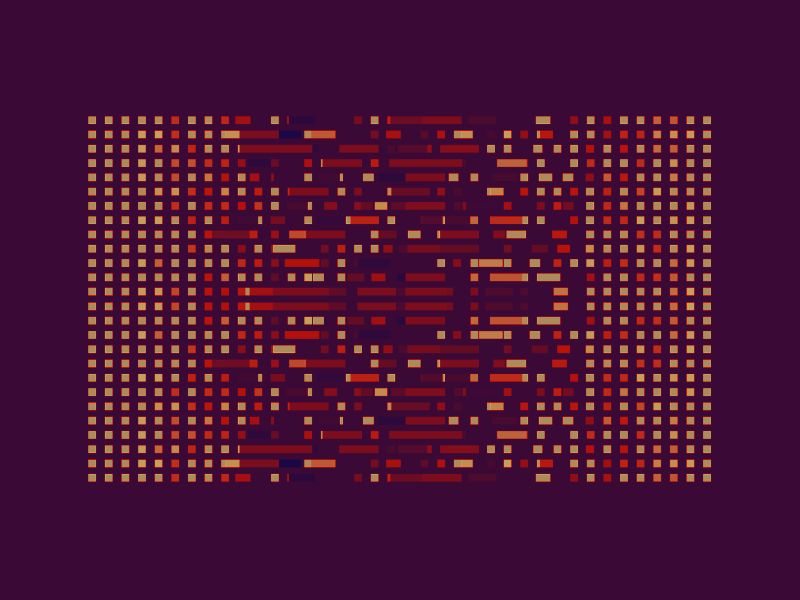

# Sorting Algorithms

This repository aims to help people understand the basic concept of the common sorting algorithms.

## Target Sorting Algorithms

- Bubble Sort
- Selection Sort
- Insertion Sort
- Merge Sort
- Quick Sort
- Heap Sort

P.S The repository is currently a work in progress 
